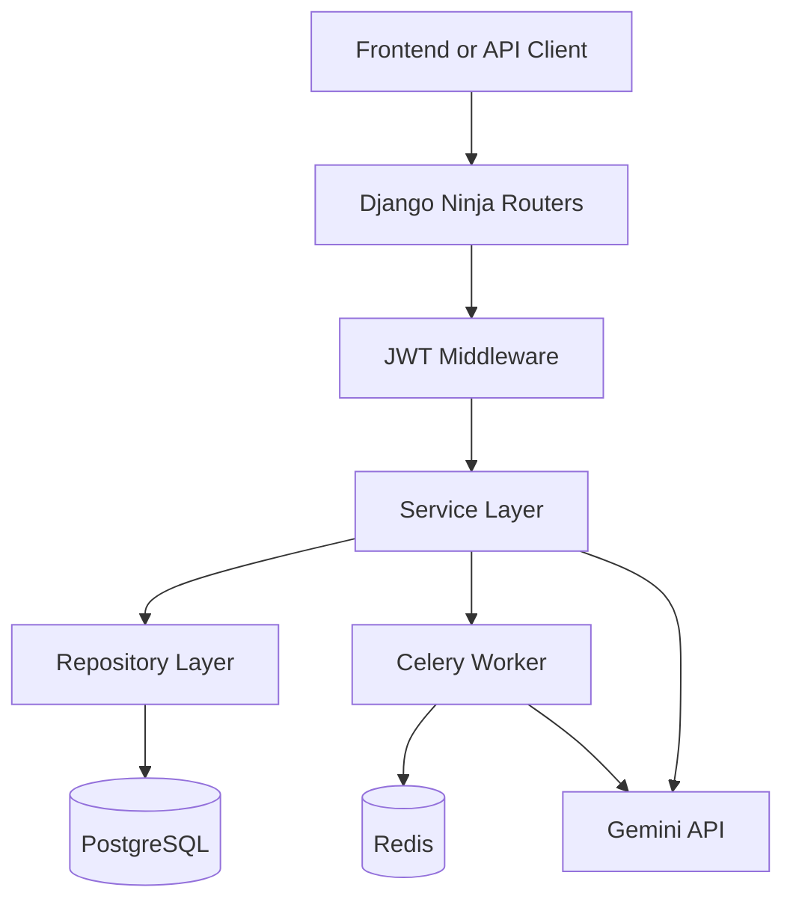

# System Architecture

## Overview

Mindorax Backend is a Django monolith with domain-separated apps and a thin API layer implemented through Django Ninja.

## Main Building Blocks

### API layer

- Entry point: `core/api.py`
- Framework: Django Ninja
- Mounted under `/api/`
- Organized by router:
  - `/auth`
  - `/subject`
  - `/quiz`
  - `/planning`

### Middleware and auth

- `apps.middleware.JWTMiddleware` reads `access_token` from request cookies
- authenticated routers use `IsAuthenticated`
- permission enforcement is cookie-driven, not bearer-header driven in practice

### Service layer

Services contain orchestration and business rules:

- `SubjectService`
- `SubjectFileService`
- `StudyPlanService`
- `QuizService`
- `GoogleAuthService`
- `TokenService`

### Repository layer

Repositories wrap common model operations and normalize `DateTimeField` payloads through `BaseRepository`.

### Async processing

Celery tasks are used for:

- subject analysis
- study plan generation
- quiz generation
- quiz report generation

Failed tasks are logged to the database through `FailedTaskAlert`.

## App-by-App Responsibilities

### Users

- Google token verification
- JWT generation and refresh
- custom email-based user model

### Subjects

- subject CRUD
- subject file upload and metadata
- AI analysis of subject content and files

### Planning

- AI study plan creation
- plan item persistence
- study session completion tracking

### Quizzes

- AI quiz generation
- question and option persistence
- quiz attempt submission
- AI performance reporting

### Logs

- failed Celery task persistence for operational review

## Request Lifecycle

### Authenticated request flow

1. Client sends request with `access_token` cookie.
2. `JWTMiddleware` verifies the JWT and attaches `request.user`.
3. Django Ninja router validates input.
4. Controller delegates to a service.
5. Service uses repositories and models.
6. Response schema serializes output.

### Async generation flow

1. API endpoint validates the request.
2. Service enqueues a Celery task.
3. Task loads the domain objects from PostgreSQL.
4. Task calls Gemini with structured prompts.
5. Parsed AI response is stored in PostgreSQL.
6. Frontend polls resource endpoints for completion.

## Runtime Dependencies

- PostgreSQL for persistent data
- Redis for cache and Celery broker
- Celery worker for background processing
- Gemini API for AI generation
- Google auth libraries for OAuth token verification

## Current Architectural Constraints

- Settings are not environment-driven yet.
- Login does not set cookies directly.
- Some async quiz status signals are not reliable yet.
- Static file production handling is not fully documented in code because `STATIC_ROOT` is not configured.
