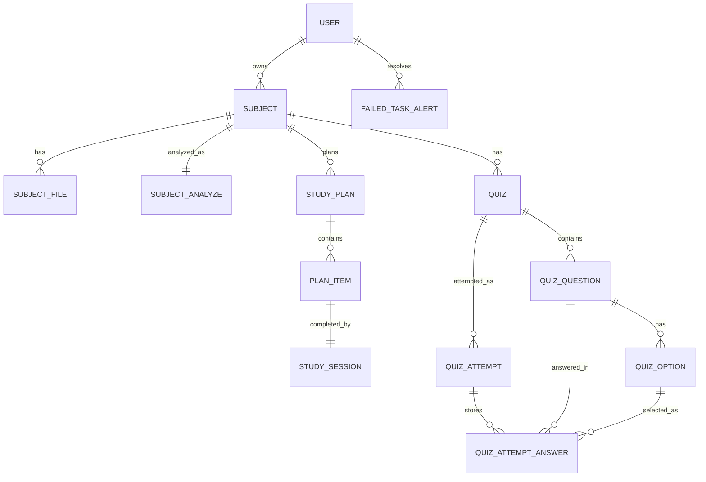

# Database Structure

This document reflects the current Django models in the repository.

## Entity Relationship Overview

## Users

### `users_user`

Primary fields:

- `id`
- `email`
- `password`
- `oauth_provider`
- `oauth_id`
- Django auth flags such as `is_staff` and `is_superuser`
- `created_at`
- `update_at`

Notes:

- `username` is disabled
- email is the login identifier

## Subjects

### `subjects_subject`

Primary fields:

- `id`
- `user_id`
- `title`
- `description`
- `goal`
- `deadline`
- `status`
- `is_analyzing`
- `is_failed_analyze`
- `created_at`
- `update_at`

### `subjects_subjectfile`

Primary fields:

- `id`
- `subject_id`
- `file`
- `file_type`
- `title`
- `description`
- `created_at`
- `update_at`

### `subjects_subjectanalyze`

Primary fields:

- `id`
- `subject_id`
- `difficulty_level`
- `summary`
- `topics`
- `subtopics`
- `concepts`
- `topic_wise_priority`
- `key_points`
- `recommended_focus`
- `estimated_hours`
- `created_at`
- `update_at`

Notes:

- this is a one-to-one record per subject
- several AI-generated fields are stored as JSON

## Planning

### `planning_studyplan`

Primary fields:

- `id`
- `subject_id`
- `ai_generated`
- `total_hours`
- `daily_study_hours`
- `starting_date`
- `end_date`
- `is_completed`
- `topics`
- `description`
- `is_creating`
- `is_failed`
- `created_at`
- `update_at`

### `planning_planitems`

Primary fields:

- `id`
- `plan_id`
- `topic`
- `description`
- `estimated_hours`
- `starting_date_time`
- `end_date_time`
- `created_at`
- `update_at`

### `planning_studysession`

Primary fields:

- `id`
- `plan_item_id`
- `start_date_time`
- `end_date_time`
- `duration`
- `created_at`
- `update_at`

Notes:

- a study session is one-to-one with a plan item
- `duration` is computed on save in minutes

## Quizzes

### `quizzes_quiz`

Primary fields:

- `id`
- `subject_id`
- `topics`
- `difficulty_level`
- `total_questions`
- `is_creating`
- `is_failed`
- `ai_report`
- `ai_report_creating`
- `created_at`
- `update_at`

### `quizzes_quizquestion`

Primary fields:

- `id`
- `quiz_id`
- `question_text`
- `explanation`
- `difficulty`
- `topic`
- `question_type`
- `created_at`
- `update_at`

### `quizzes_quizquestionoption`

Primary fields:

- `id`
- `question_id`
- `text`
- `is_correct`
- `created_at`
- `update_at`

### `quizzes_quizattempts`

Primary fields:

- `id`
- `quiz_id`
- `score`
- `total_score`
- `time_taken`
- `created_at`
- `update_at`

### `quizzes_quizattemptanswer`

Primary fields:

- `id`
- `attempt_id`
- `question_id`
- `selected_option_id`
- `is_correct`
- `created_at`
- `update_at`

## Operational Logging

### `logs_failedtaskalert`

Primary fields:

- `id`
- `task_name`
- `payload`
- `error_message`
- `traceback`
- `status`
- `created_at`
- `resolved_at`
- `resolved_by_id`
- `notes`

## Practical Notes For Frontend Teams

- Subject response objects do not currently expose subject IDs.
- Planning and quiz resources are better suited for polling because the write endpoints are asynchronous.
- JSON-backed fields such as `topics`, `subtopics`, and `concepts` should be treated as structured payloads rather than plain strings.
